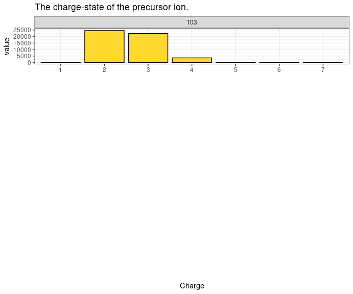
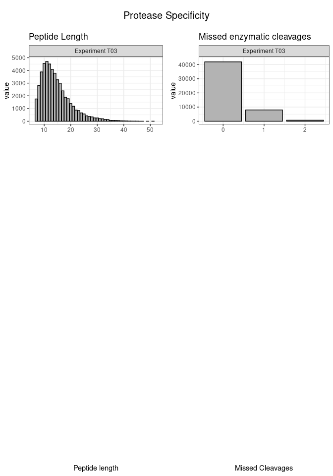
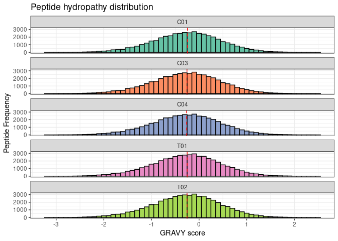
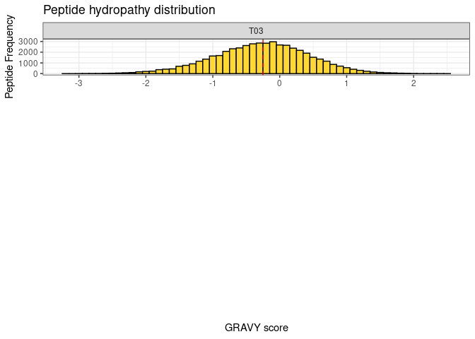
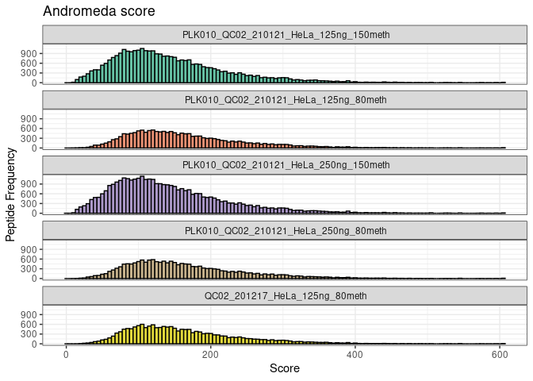
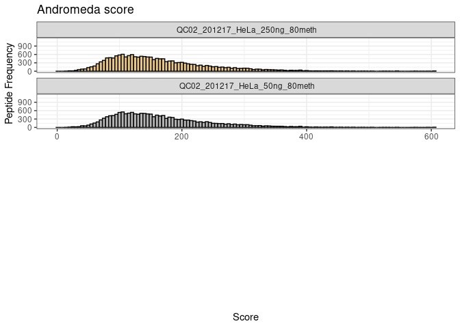
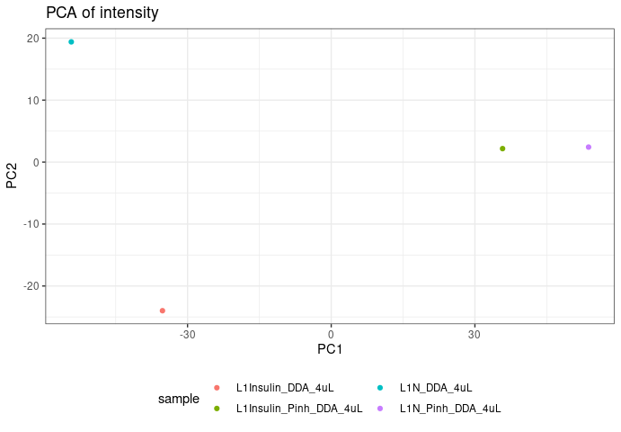
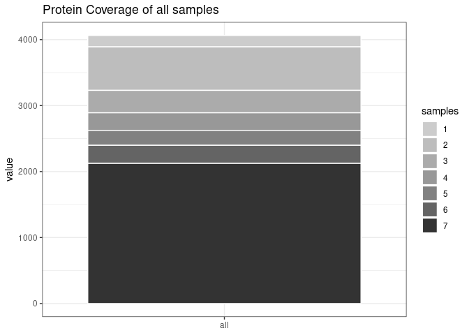
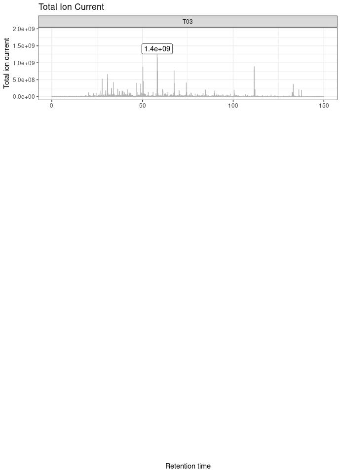
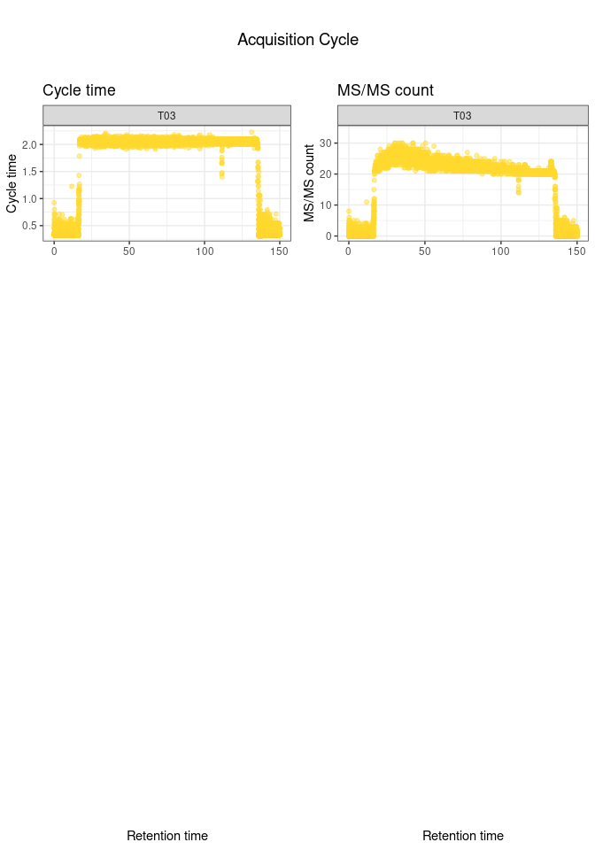

<!-- README.md is generated from README.Rmd. Please edit that file -->

# MQmetrics

<!-- badges: start -->

<!-- badges: end -->

The goal of MQmetrics is to analyze Proteomics data from LC-MS/MS. It
takes the output tables from MaxQuant and plots multiple parameters.

## Installation

<!-- You can install thess released version of MQmetrics from [CRAN](https://CRAN.R-project.org) with: -->

<!-- ``` r -->

<!-- install.packages("MQmetrics") -->

<!-- ``` -->

You can install the development version from
[GitHub](https://github.com/) with:

``` r
# install.packages("devtools")
devtools::install_github("BioAlvaro/MQmetrics")
```

## Example

``` r
library(MQmetrics)
```

``` r
MQPathCombined <- '/home/alvaro/Documents/MaxQuant/example2/'

files <- ReadDataFromDir(MQPathCombined) #This function will read the tables needed for creating the outputs.

# files can be extracted like this:

summary <- files[["summary.txt"]]
evidence <- files[["evidence.txt"]]
msScans <- files[['msScans.txt']]
peptides <- files[["peptides.txt"]]
msmsScans <- files[["msmsScans.txt"]]
proteinGroups <- files[["proteinGroups.txt"]]
modificationSpecificPeptides <- files[["modificationSpecificPeptides.txt"]]
parameters <- files[["parameters.txt"]]
runningTimes <-  files[["#runningTimes.txt"]]
```

``` r
ExperimentInformation(runningTimes, parameters) 
[1] "The experiment started the day: 03/02/2021 at the time: 14:14:22."
[1] "The whole experiment lasted: 01:33 (hours:minutes)."
[1] "The MaxQuant version used was: 1.6.12.0"
[1] "The user was: marek.vrbacky"
[1] "The machine name was: FGU013PC029"
[1] "The protein FDR was: 0.01"
[1] "The match between runs was: False"
[1] "The fasta file used was: "


#add more paramaters, source directory.
#if LFQ was used or not.
#Show fixed and variable Modifications specified. (from xmparxl file)

#FDR at the three levels psm , peptide, protein

#FRom XML file

#
```

``` r
PlotProteinsIdentified(proteinGroups, intensity_type = 'Intensity', long_names = TRUE, sep_names = '_')
```


``` r
PlotPeptidesIdentified(summary, long_names = TRUE, sep_names = '_')
```


``` r

#Show in the tables a a percentage.
```

``` r
PlotMsMs(summary,long_names = TRUE, sep_names = '_')
```


``` r

#Show 40% line
```

``` r
PlotPeaks(summary, long_names = TRUE, sep_names = '_')
```


``` r
PlotIsotopePattern(summary,long_names = TRUE, sep_names = '_')
```


``` r
PlotCharge(evidence)
```



``` r
PlotProteaseSpecificity(peptides)
```



``` r

# show in tabular format. (table.) 
```

``` r
PlotHydrophobicity(peptides, palette = 'Set2', show_median =  TRUE, binwidth = 0.1)
```



``` r

#make the line thicker
```

``` r
PlotAndromedaScore(peptides)
```



``` r
if(parameters$Value[27] == "True"){
  PlotIdentificationType(peptides, 
                         proteinGroups,
                         palette = 'Set2',
                         long_names = TRUE, 
                         sep_names = '_')  
} else{
  cat('Match Between Runs was not used during the MaxQuant analysis.
No Identification Type to show.')
}
#> Match Between Runs was not used during the MaxQuant analysis.
#> No Identification Type to show.
```

``` r
PlotIntensity(proteinGroups, split_violin_intensity = TRUE, intensity_type = 'LFQ', 
              log_base = 2, long_names = TRUE, sep_names = '_')
#> [1] "LFQ intensities not found, split_violin_plot can not be created"
#> [1] "Changing intensity automatically to Intensity"
```


``` r


### when too many samples more than 20, the split_violin function did not work.
```

``` r
PlotPCA(proteinGroups, intensity_type = 'Intensity', palette = 'Set2')
```



``` r
PlotCombinedDynamicRange(proteinGroups, show_shade = TRUE, percent_proteins = 0.79)
```


``` r
PlotAllDynamicRange(proteinGroups,show_shade = TRUE, percent_proteins = 0.90)
```


``` r
PlotProteinCoverageAll(proteinGroups)
```



``` r

#Put in a table at the end of tables.
```

``` r
PlotProteinCoverage(peptides,proteinGroups, UniprotID = "Q99714", log_base = 2, segment_width = 1)
```


``` r
PlotiRT(evidence)
```


``` r
PlotiRTScore(evidence)
```


``` r
PlotTotalIonCurrent(msmsScans, show_max_value = TRUE)
```



``` r
PlotAcquisitionCycle(msScans)
```



``` r
PlotPTM(modificationSpecificPeptides, peptides_modified = 1, plot_unmodified_peptides = FALSE, palette = 'Set2')
```


