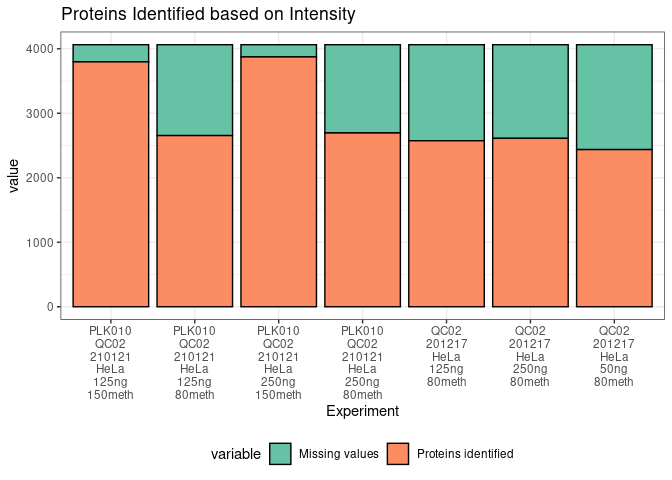
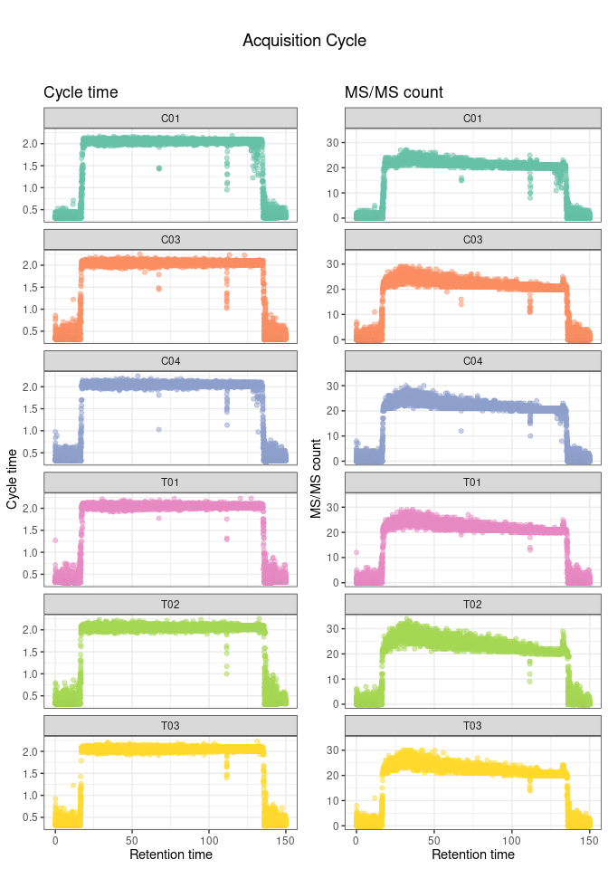
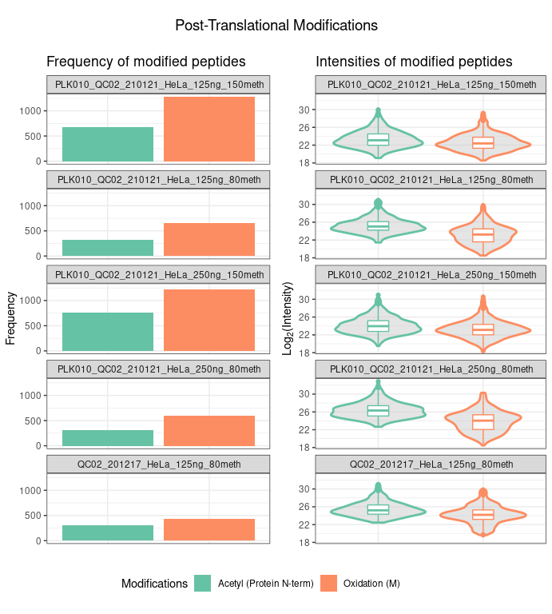

<!-- README.md is generated from README.Rmd. Please edit that file -->

# MQmetrics

<!-- badges: start -->

<!-- badges: end -->

The goal of MQmetrics is to analyze Proteomics data from LC-MS/MS. It
takes the output tables from MaxQuant and plots multiple parameters.

## Installation

<!-- You can install thess released version of MQmetrics from [CRAN](https://CRAN.R-project.org) with: -->

<!-- ``` r -->

<!-- install.packages("MQmetrics") -->

<!-- ``` -->

And the development version from [GitHub](https://github.com/) with:

``` r
# install.packages("devtools")
devtools::install_github("BioAlvaro/MQmetrics")
```

## Example

``` r
library(MQmetrics)
```

``` r
MQPathCombined <- system.file('extdata', package = 'MQmetrics') #is the directory with the output of the MaxQuant analysis.

#MQPathCombined <- '/home/alvaro/Documents/MaxQuant/example5/combined/'

files <- ReadDataFromDir(MQPathCombined) #This function will read the tables needed for creating the outputs.

#files can be extracted like this:

summary <- files[["summary.txt"]]
evidence <- files[["evidence.txt"]]
msScans <- files[['msScans.txt']]
peptides <- files[["peptides.txt"]]
msmsScans <- files[["msmsScans.txt"]]
proteinGroups <- files[["proteinGroups.txt"]]
modificationSpecificPeptides<- files[["modificationSpecificPeptides.txt"]]
runningTimes <-  files[["#runningTimes.txt"]]
parameters <- files[["parameters.txt"]]
```

``` r
ExperimentInformation(runningTimes, parameters) 
[1] "The experiment started the day: 17/02/2021 at the time: 18:57:27."
[1] "The whole experiment lasted: 05:48 (hours:minutes)."
[1] "The MaxQuant version used was: 1.6.12.0"
[1] "The user was: marek.vrbacky"
[1] "The machine name was: FGU013PC029"
[1] "The protein FDR was: 0.01"
[1] "The match between runs was: True"
[1] "The fasta file used was: C:\\MaxQuant_Databases\\UP000000589_10090.fasta"
```

``` r
PlotProteinsIdentified(proteinGroups, intensity_type = 'Intensity',long_names = TRUE, sep_names = '_')
```



``` r
PLotPeptidesIdentified(summary, long_names = TRUE, sep_names = '_')
```


``` r
#PSMs identified
```

``` r
PlotMsMs(summary,long_names = TRUE, sep_names = '_')
```


``` r
PlotPeaks(summary, long_names = TRUE, sep_names = '_')
```


``` r
PlotIsotopePattern(summary,long_names = TRUE, sep_names = '_')
```


``` r
PlotCharge(evidence)
```


``` r

PlotProteaseSpecificity(peptides)
```


``` r
PlotIdentificationType(peptides,proteinGroups, long_names = TRUE, sep_names = '_')
```


``` r
PlotIntensity(proteinGroups, split_violin_intensity = TRUE, intensity_type = 'Intensity', 
              log_base = 2, long_names = TRUE, sep_names = '_')
```


``` r
PlotCombinedDynamicRange(proteinGroups, show_shade = TRUE, percent_proteins = 0.79)
```


``` r
PLotAllDynamicRange(proteinGroups,show_shade = TRUE, percent_proteins = 0.90)
```


``` r
PlotProteinCoverage(peptides,proteinGroups ,UniprotID = "Q8R0Y6", log_base = 10, segment_width = 1)
```


``` r
Path_iRT_run_with_iRT_peptides <- '/home/alvaro/Documents/MaxQuant/example3/'

files_irt <- ReadDataFromDir(Path_iRT_run_with_iRT_peptides)

evidence_irt <- files_irt[['evidence.txt']]
PlotiRT(evidence_irt, show_calibrated_rt = FALSE)
```


``` r

PlotiRTScore(evidence_irt)
```


``` r
PlotTotalIonCurrent(msmsScans, show_max_value = TRUE)
```


``` r
PlotAcquisitionCycle(msScans)
```



``` r

PlotPTM(modificationSpecificPeptides, peptides_modified = 3)
```


