<!-- README.md is generated from README.Rmd. Please edit that file -->

# ProteoMS

<!-- badges: start -->

<!-- badges: end -->

The goal of ProteoMS is to analyze Proteomics data from LC-MS/MS. It
takes the output tables from MaxQuant and plots multiple parameters.

## Installation

<!-- You can install thess released version of ProteoMS from [CRAN](https://CRAN.R-project.org) with: -->

<!-- ``` r -->

<!-- install.packages("ProteoMS") -->

<!-- ``` -->

And the development version from [GitHub](https://github.com/) with:

``` r
# install.packages("devtools")
devtools::install_github("BioAlvaro/ProteoMS")
```

## Example

``` r
library(ProteoMS)
```

``` r
MQPathCombined <- system.file('extdata', package = 'ProteoMS') #is the directory with the output of the MaxQuant analysis.

#MQPathCombined <- '/home/alvaro/Documents/MaxQuant_results/combined/'

files <- ReadDataFromDir(MQPathCombined) #This function will read the tables needed for creating the outputs.

#files can be extracted like this:

summary <- files[["summary.txt"]]
evidence <- files[["evidence.txt"]]
peptides <- files[["peptides.txt"]]
msmsScans <- files[["msmsScans.txt"]]  
proteinGroups <- files[["proteinGroups.txt"]]
runningTimes <-  files[["#runningTimes.txt"]]
parameters <- files[["parameters.txt"]]
```

``` r
ExperimentInformation(runningTimes, parameters) 
[1] "The experiment started the day: 17/02/2021 at the time: 18:57:27."
[1] "The whole experiment lasted: 05:48 (hours:minutes)."
[1] "The MaxQuant version used was: 1.6.12.0"
[1] "The user was: marek.vrbacky"
[1] "The machine name was: FGU013PC029"
[1] "The protein FDR was: 0.01"
[1] "The match between runs was: True"
[1] "The fasta file used was: C:\\MaxQuant_Databases\\UP000000589_10090.fasta"
```

``` r
PlotPeaks(summary, long_names = TRUE, sep_names = '_')
```

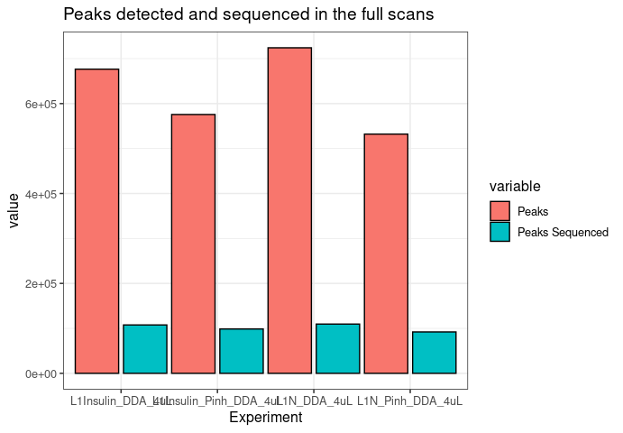

``` r
PlotMsMs(summary,long_names = TRUE, sep_names = '_')
```

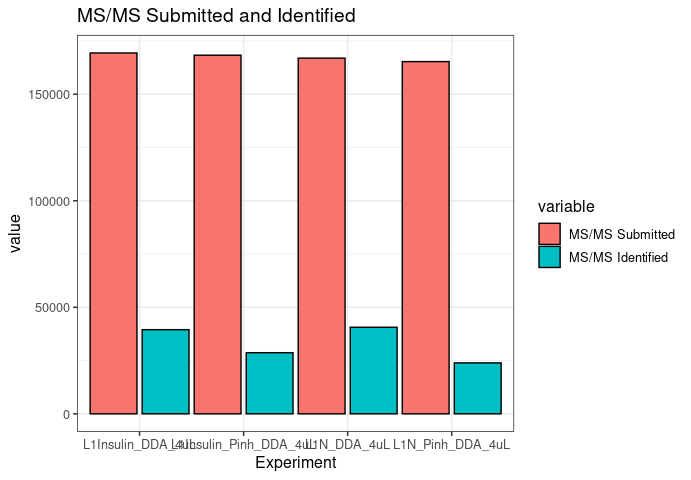

``` r
PlotIsotopePattern(summary,long_names = TRUE, sep_names = '_')
```

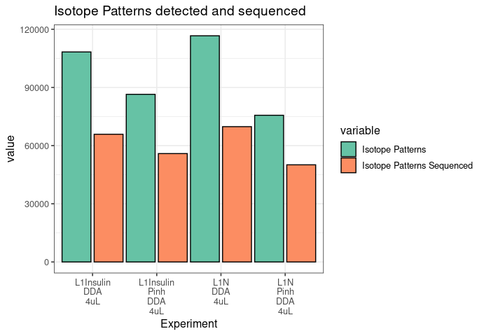

``` r
PLotPeptidesIdentified(summary, long_names = TRUE, sep_names = '_')
```

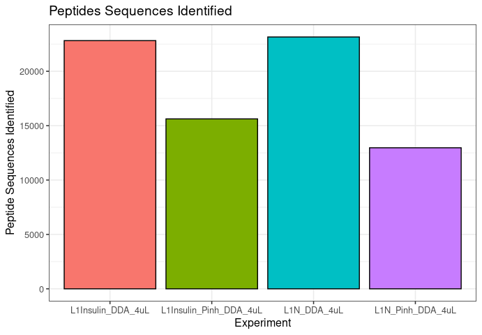

``` r

PlotIntensity(proteinGroups, intensity_type = 'LFQ', log_base = 10, long_names = TRUE, sep_names = '_')
```

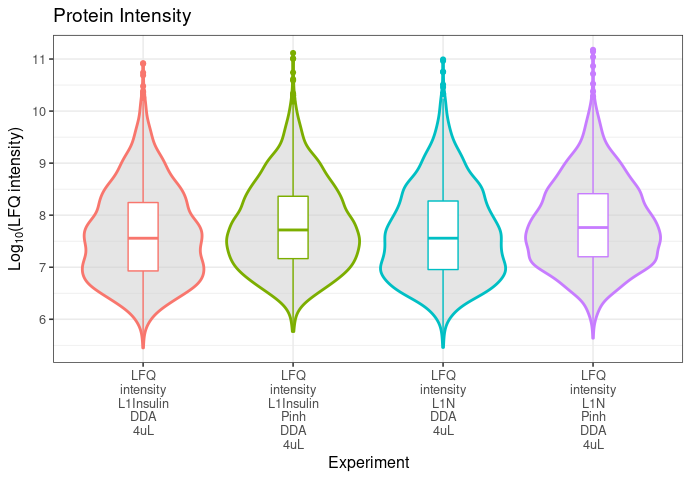

``` r
Path_iRT_run_with_iRT_peptides <- '/home/alvaro/Documents/MaxQuant/example3/'

files_irt <- ReadDataFromDir(Path_iRT_run_with_iRT_peptides)

evidence_irt <- files_irt[['evidence.txt']]
PlotiRT(evidence_irt, show_calibrated_rt = FALSE)
```

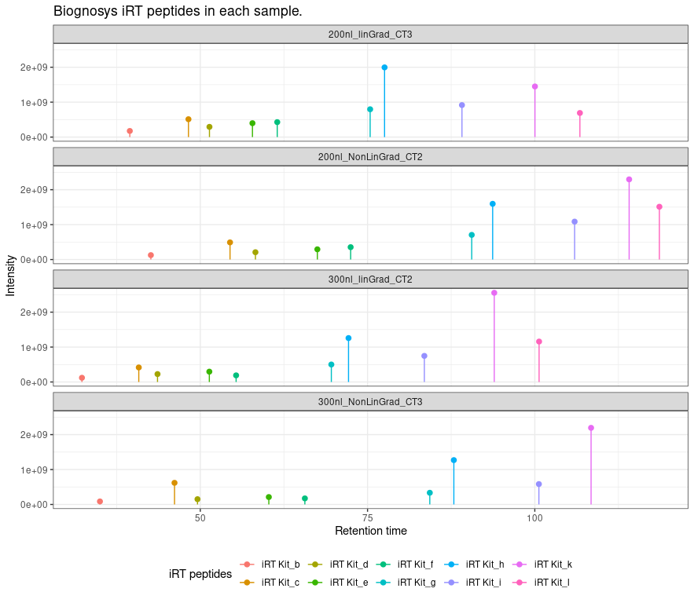

``` r

PlotiRTScore(evidence_irt)
```

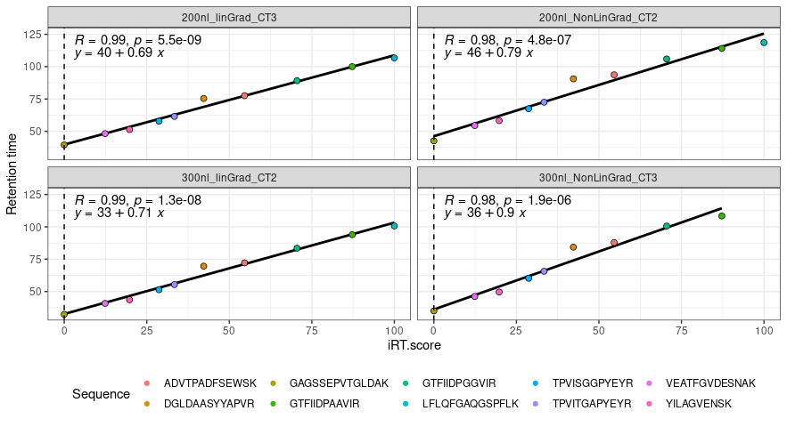

``` r
PlotIdentificationType(peptides, long_names = TRUE, sep_names = '_')
#> Using sample as id variables
```

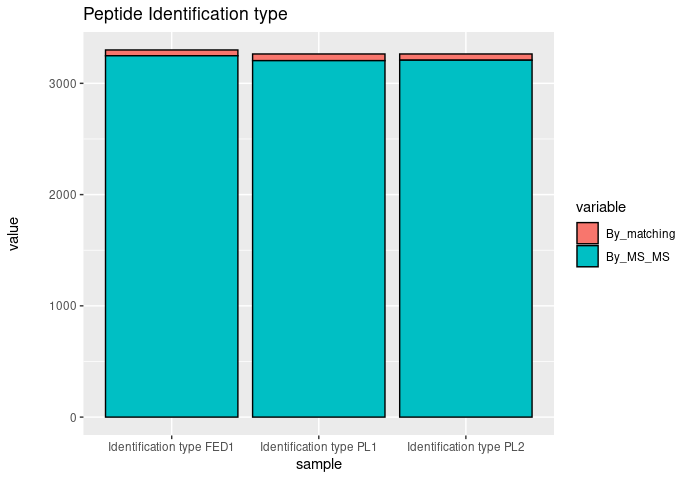

``` r
PlotCharge(evidence_irt)
```

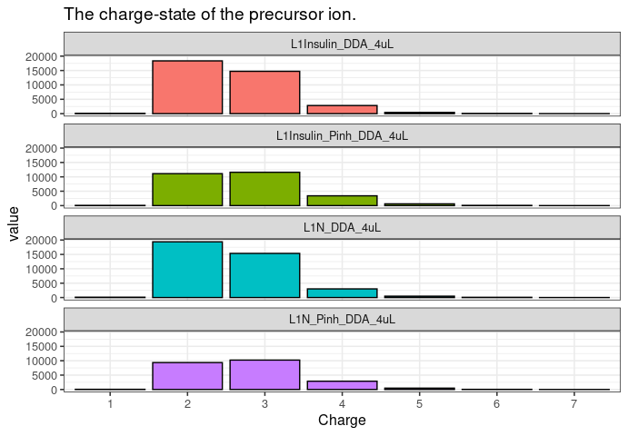

``` r

PlotMissedCleavages(peptides)
```

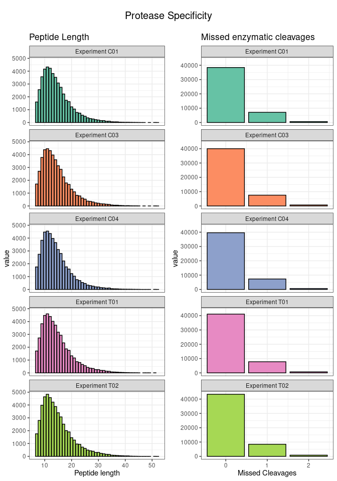

``` r
PlotTotalIonCurrent(msmsScans)
```

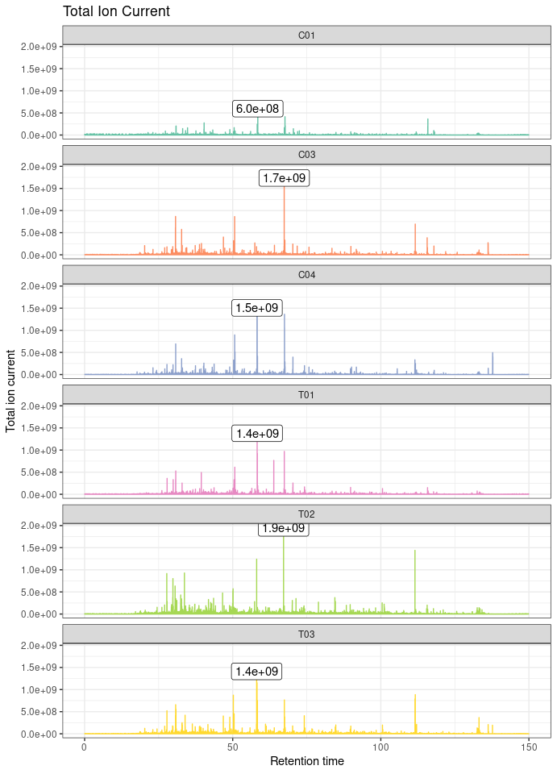

``` r
PlotProteinCoverage(peptides)
```

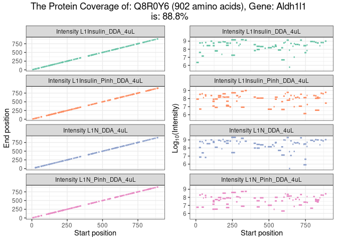

``` r
PlotCombinedDynamicRange(proteinGroups)
```

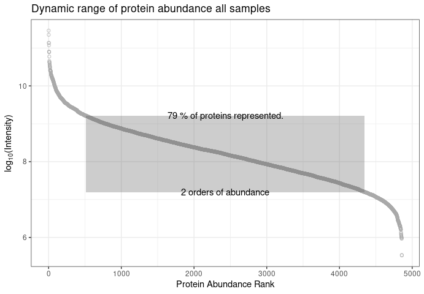

``` r
PLotAllDynamicRange(proteinGroups,columns = 1,rows = 3)
```

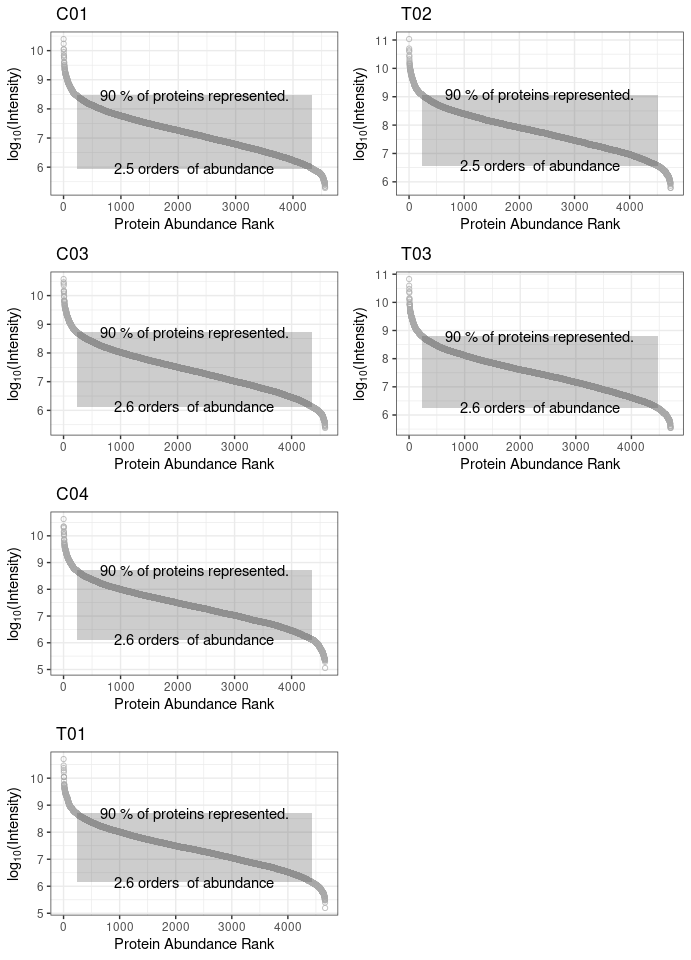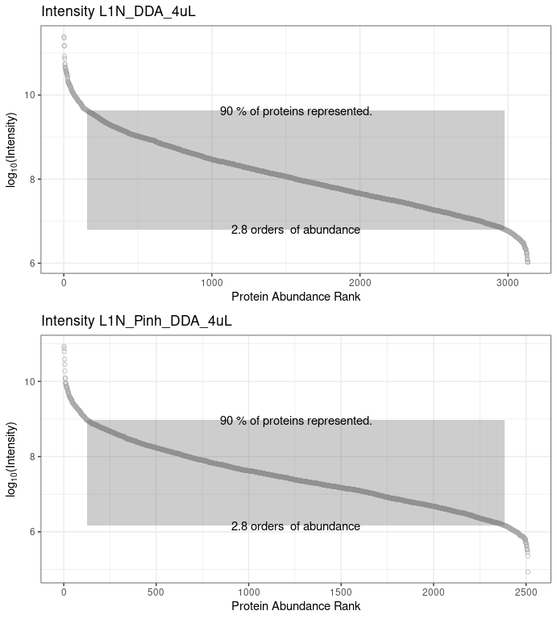
